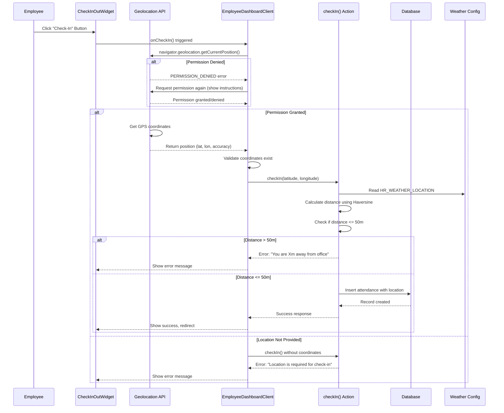

# GPS Radius Che

ck-In Feature Implementation

## Overview

Implement GPS-based radius check-in validation that requires employees to be within 50 meters of the office location to check in. The system uses browser Geolocation API, validates location on both client and server, and stores location data for audit purposes.

## Requirements Summary

- **Location Source**: Initially use `HR_WEATHER_LOCATION` from `lib/weather/config.ts`
- **Radius**: 50 meters
- **Location Required**: Always required for check-in (no optional mode)
- **Check-Out**: Does NOT require location validation
- **Permission Handling**: Request permission again if denied
- **Multiple Locations**: Database supports multiple locations, but single location used initially
- **Rejection**: Reject check-in if location not provided

## Architecture Flow




## Implementation Phases

### Phase 1: Database Schema Changes

**File**: `database/migrations/[timestamp]_add_check_in_location_fields.sql`**Changes**:

1. Add location columns to `attendance_records`:
   ```sql
               ALTER TABLE attendance_records
               ADD COLUMN check_in_latitude DECIMAL(10, 8),
               ADD COLUMN check_in_longitude DECIMAL(11, 8),
               ADD COLUMN check_in_location_accuracy DECIMAL(6, 2);
               
               -- Add constraints
               ALTER TABLE attendance_records
               ADD CONSTRAINT valid_check_in_latitude 
                 CHECK (check_in_latitude IS NULL OR (check_in_latitude >= -90 AND check_in_latitude <= 90)),
               ADD CONSTRAINT valid_check_in_longitude 
                 CHECK (check_in_longitude IS NULL OR (check_in_longitude >= -180 AND check_in_longitude <= 180));
   ```


2. Create `check_in_locations` table (for future multi-location support):
   ```sql
               CREATE TABLE check_in_locations (
                   id UUID PRIMARY KEY DEFAULT gen_random_uuid(),
                   name TEXT NOT NULL,
                   latitude DECIMAL(10, 8) NOT NULL,
                   longitude DECIMAL(11, 8) NOT NULL,
                   radius_meters INTEGER NOT NULL DEFAULT 50,
                   google_maps_url TEXT,
                   is_active BOOLEAN NOT NULL DEFAULT TRUE,
                   created_by UUID NOT NULL REFERENCES users(id) ON DELETE CASCADE,
                   created_at TIMESTAMP WITH TIME ZONE NOT NULL DEFAULT NOW(),
                   updated_at TIMESTAMP WITH TIME ZONE NOT NULL DEFAULT NOW(),
                   
                   CONSTRAINT valid_latitude CHECK (latitude >= -90 AND latitude <= 90),
                   CONSTRAINT valid_longitude CHECK (longitude >= -180 AND longitude <= 180),
                   CONSTRAINT valid_radius CHECK (radius_meters > 0 AND radius_meters <= 1000)
               );
               
               CREATE INDEX idx_check_in_locations_is_active ON check_in_locations(is_active);
               CREATE INDEX idx_check_in_locations_created_by ON check_in_locations(created_by);
   ```


3. Add location reference to `attendance_records` (optional, for future use):
   ```sql
               ALTER TABLE attendance_records
               ADD COLUMN check_in_location_id UUID REFERENCES check_in_locations(id) ON DELETE SET NULL;
   ```


**File**: `database/migrations/[timestamp]_check_in_locations_rls.sql`**RLS Policies**:

- Enable RLS on `check_in_locations`
- Policy: "HR admins can manage all locations" - SELECT, INSERT, UPDATE, DELETE for HR admins
- Policy: "All authenticated users can view active locations" - SELECT for active locations

### Phase 2: Utility Functions

**File**: `lib/utils/geolocation.ts` (new file)**Functions**:

1. **`calculateDistance(lat1, lon1, lat2, lon2): number`**

- Haversine formula implementation
- Returns distance in meters
- Handles edge cases (same point, invalid coordinates)

2. **`validateCoordinates(lat: number, lon: number): boolean`**

- Validates latitude (-90 to 90) and longitude (-180 to 180)
- Returns true if valid

3. **`getOfficeLocation(): { latitude: number; longitude: number; radius: number }`**

- Reads from `HR_WEATHER_LOCATION` config
- Returns office location with default 50m radius
- Future: Can be extended to query database for active locations

**File**: `lib/utils/googleMapsParser.ts` (new file, for future use)**Functions**:

1. **`parseGoogleMapsUrl(url: string): ParsedLocation | null`**

- Parses Google Maps URLs to extract lat/lon
- Supports multiple URL formats
- Returns null if parsing fails

2. **`validateCoordinates(lat: number, lon: number): boolean`**

- Reuses validation logic

### Phase 3: Server Actions

**File**: `lib/actions/shared/attendance.ts`**Update `checkIn()` function**:**New Signature**:

```typescript
export async function checkIn(
  latitude?: number,
  longitude?: number,
  accuracy?: number
): Promise<...>
```

**New Validation Logic**:

1. **Location Required Check**:
   ```typescript
               if (latitude === undefined || longitude === undefined) {
                 return { error: 'Location is required for check-in. Please enable location services.' };
               }
   ```


2. **Coordinate Validation**:
   ```typescript
               if (!validateCoordinates(latitude, longitude)) {
                 return { error: 'Invalid location coordinates' };
               }
   ```


3. **Distance Calculation**:
   ```typescript
               const officeLocation = getOfficeLocation();
               const distance = calculateDistance(
                 latitude,
                 longitude,
                 officeLocation.latitude,
                 officeLocation.longitude
               );
   ```


4. **Radius Validation**:
   ```typescript
               if (distance > officeLocation.radius) {
                 return { 
                   error: `You are ${Math.round(distance)}m away from the office. Please move within ${officeLocation.radius}m to check in.` 
                 };
               }
   ```


5. **Store Location in Database**:
   ```typescript
               .insert({
                 user_id: user.id,
                 date: today,
                 check_in_time: checkInTime,
                 check_in_status: checkInStatus,
                 check_in_latitude: latitude,      // NEW
                 check_in_longitude: longitude,   // NEW
                 check_in_location_accuracy: accuracy || null, // NEW (optional)
               })
   ```


**Note**: `checkOut()` function remains unchanged (no location validation required).

### Phase 4: Client-Side Location Handling

**File**: `app/(employee)/_components/EmployeeDashboardClient.tsx`**Update `handleCheckIn()` function**:**New Flow**:

1. **Check Geolocation Support**:
   ```typescript
               if (!navigator.geolocation) {
                 alert('Geolocation is not supported by your browser. Please use a modern browser.');
                 setIsLoading(false);
                 return;
               }
   ```


2. **Request Location**:
   ```typescript
               navigator.geolocation.getCurrentPosition(
                 async (position) => {
                   const { latitude, longitude, accuracy } = position.coords;
                   
                   // Validate coordinates exist
                   if (latitude === undefined || longitude === undefined) {
                     alert('Failed to get location coordinates. Please try again.');
                     setIsLoading(false);
                     return;
                   }
                   
                   // Call server action with location
                   const result = await checkIn(latitude, longitude, accuracy);
                   
                   // Handle result...
                 },
                 (error) => {
                   // Error handling
                   handleGeolocationError(error);
                   setIsLoading(false);
                 },
                 {
                   enableHighAccuracy: true,
                   timeout: 10000, // 10 seconds
                   maximumAge: 0, // Don't use cached position
                 }
               );
   ```


3. **Error Handling Function**:
   ```typescript
               const handleGeolocationError = (error: GeolocationPositionError) => {
                 switch (error.code) {
                   case error.PERMISSION_DENIED:
                     alert('Location permission is required to check in. Please enable location access in your browser settings and try again.');
                     break;
                   case error.POSITION_UNAVAILABLE:
                     alert('Unable to get your location. Please check your device settings and try again.');
                     break;
                   case error.TIMEOUT:
                     alert('Location request timed out. Please try again.');
                     break;
                   default:
                     alert('Failed to get your location. Please try again.');
                 }
               };
   ```


### Phase 5: UI/UX Enhancements

**File**: `components/employee/CheckInOutWidget.tsx`**Updates**:

1. **Loading State**: Show "Getting location..." when requesting GPS
2. **Error Display**: Show location-related errors clearly
3. **Button Disable**: Disable check-in button while requesting location

**File**: `app/(employee)/_components/EmployeeDashboardClient.tsx`**Updates**:

1. **Location Status Indicator** (optional): Show location permission status
2. **Error Messages**: User-friendly error messages for location issues
3. **Retry Mechanism**: Allow retry if location request fails

### Phase 6: Future Multi-Location Support (Database Ready)

**File**: `lib/actions/hr/checkInLocations.ts` (new file, for future use)**Server Actions** (not implemented yet, but database ready):

- `addCheckInLocation()` - Add new location from Google Maps URL
- `getCheckInLocations()` - Get all active locations
- `toggleLocationStatus()` - Activate/deactivate location
- `deleteCheckInLocation()` - Delete location

**Update `getOfficeLocation()` in `lib/utils/geolocation.ts`**:

- Future: Query database for active locations instead of using config
- For now: Continue using `HR_WEATHER_LOCATION` config

## Key Implementation Details

### Haversine Formula

```typescript
function calculateDistance(lat1: number, lon1: number, lat2: number, lon2: number): number {
  const R = 6371000; // Earth radius in meters
  const dLat = toRadians(lat2 - lat1);
  const dLon = toRadians(lon2 - lon1);
  
  const a = 
    Math.sin(dLat / 2) * Math.sin(dLat / 2) +
    Math.cos(toRadians(lat1)) * Math.cos(toRadians(lat2)) *
    Math.sin(dLon / 2) * Math.sin(dLon / 2);
  
  const c = 2 * Math.atan2(Math.sqrt(a), Math.sqrt(1 - a));
  const distance = R * c;
  
  return distance;
}

function toRadians(degrees: number): number {
  return degrees * (Math.PI / 180);
}
```


### Error Handling Strategy

1. **Client-Side**:

- Check browser support
- Handle permission denied (show instructions)
- Handle timeout (allow retry)
- Handle position unavailable (show error)

2. **Server-Side**:

- Validate coordinates exist
- Validate coordinate ranges
- Calculate distance
- Return user-friendly error messages

### Security Considerations

1. **Server-Side Validation**: Always validate location on server (client can be manipulated)
2. **Coordinate Validation**: Ensure coordinates are within valid ranges
3. **Accuracy Consideration**: Store accuracy for audit, but don't reject based on accuracy alone
4. **Privacy**: Only store location during check-in, not continuously

## Testing Checklist

- [ ] Check-in with valid location (within 50m) succeeds
- [ ] Check-in with location > 50m away fails with distance message
- [ ] Check-in without location permission shows error
- [ ] Check-in with location permission denied shows instructions
- [ ] Check-in with location timeout allows retry
- [ ] Check-in with invalid coordinates fails
- [ ] Location is stored in database correctly
- [ ] Check-out works without location (no validation)
- [ ] Multiple check-in attempts on same day are prevented
- [ ] Error messages are user-friendly and actionable

## Migration Order

1. Create database migration for location fields
2. Create RLS policies for check_in_locations table
3. Implement utility functions (geolocation, distance calculation)
4. Update server action (checkIn) with location validation
5. Update client-side check-in flow with Geolocation API
6. Test end-to-end flow
7. Deploy and monitor

## Rollback Plan

If issues arise:

1. Make location optional temporarily (add feature flag)
2. Remove location validation from server action
3. Keep database columns (nullable, so no data loss)
4. Revert client-side changes

## Future Enhancements (Not in Scope)

- Multiple office locations management UI