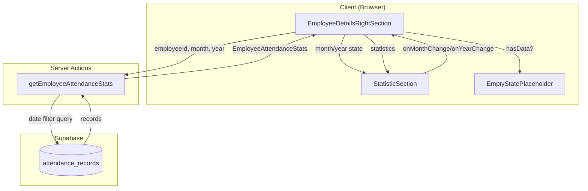

# Design Document: Employee Statistics Filter

## Overview

This feature extends the Employee Details page to support filtering attendance statistics by year and month. The implementation adds dynamic data fetching based on dropdown selections, calculates period-specific statistics, and displays appropriate empty states when no data exists.

The solution follows the existing patterns in the codebase, using React hooks for state management, server actions for data fetching, and the existing StatisticSection component for UI rendering.

## Architecture



## Components and Interfaces

### 1. Modified Server Action: `getEmployeeAttendanceStats`

**File:** `lib/actions/hr/employeeDetails.ts`

The existing function will be extended to accept optional month and year parameters:

```typescript
export async function getEmployeeAttendanceStats(
  employeeId: string,
  month?: number,  // 1-12, defaults to current month
  year?: number    // e.g., 2025, defaults to current year
): Promise<{ data?: EmployeeAttendanceStats; error?: string }>
```

**Query Logic:**
- Calculate start and end dates for the selected month/year in GMT+7
- Filter `attendance_records` by `date >= startDate AND date <= endDate`
- Calculate average hours worked and average check-in time from filtered records

### 2. Modified Component: `EmployeeDetailsRightSection`

**File:** `components/hr/employee/EmployeeDetailsRightSection.tsx`

State additions:
```typescript
const [selectedMonth, setSelectedMonth] = useState<number>(currentMonth);
const [selectedYear, setSelectedYear] = useState<number>(currentYear);
const [statsLoading, setStatsLoading] = useState(false);
```

The component will:
- Pass `selectedMonth` and `selectedYear` to `StatisticSection`
- Handle `onMonthChange` and `onYearChange` callbacks
- Re-fetch statistics when month/year changes
- Display empty state when no data exists

### 3. New Component: `EmptyStatePlaceholder`

**File:** `components/hr/employee/EmptyStatePlaceholder.tsx`

A simple placeholder component displayed when no statistics data exists:

```typescript
interface EmptyStatePlaceholderProps {
  month: string;  // e.g., "December"
  year: number;   // e.g., 2025
}
```

### 4. StatisticSection Props (Already Exists)

The existing `StatisticSection` component already supports the required props:
- `selectedMonth?: number`
- `selectedYear?: number`
- `onMonthChange?: (month: number) => void`
- `onYearChange?: (year: number) => void`

## Data Models

### EmployeeAttendanceStats (Existing)

```typescript
interface EmployeeAttendanceStats {
  avgHoursWorked: number | null;
  avgCheckInTimeMinutes: number | null;
  periodLabel: string;
}
```

### Database Query

```sql
SELECT total_hours, check_in_time
FROM attendance_records
WHERE user_id = :employeeId
  AND date >= :startDate
  AND date <= :endDate
```

Where:
- `startDate` = First day of selected month/year in GMT+7
- `endDate` = Last day of selected month/year in GMT+7

## Correctness Properties

*A property is a characteristic or behavior that should hold true across all valid executions of a system-essentially, a formal statement about what the system should do. Properties serve as the bridge between human-readable specifications and machine-verifiable correctness guarantees.*

### Property 1: Filter selection triggers data fetch with correct parameters
*For any* valid month (1-12) and year selection, when the user changes the dropdown value, the system should trigger a data fetch with the exact month and year values selected.
**Validates: Requirements 1.1, 1.2**

### Property 2: Average hours calculation correctness
*For any* set of attendance records within a month/year period, the calculated average hours worked should equal the sum of all `total_hours` values divided by the count of records with non-null `total_hours`.
**Validates: Requirements 2.1**

### Property 3: Average check-in time calculation correctness
*For any* set of attendance records within a month/year period, the calculated average check-in time (in minutes from midnight) should equal the sum of all check-in times converted to minutes divided by the count of records with non-null `check_in_time`.
**Validates: Requirements 2.2**

### Property 4: Date filtering uses correct timezone boundaries
*For any* month/year selection, the date filter should include all records where the `date` field falls within the first and last day of that month in GMT+7 timezone, inclusive.
**Validates: Requirements 2.3**

### Property 5: Statistics serialization round-trip
*For any* valid `EmployeeAttendanceStats` object, serializing to JSON and deserializing back should produce an equivalent object with all fields preserved (avgHoursWorked, avgCheckInTimeMinutes, periodLabel).
**Validates: Requirements 4.1, 4.2, 4.3, 4.4**

## Error Handling

| Scenario | Handling |
|----------|----------|
| Network error during fetch | Display error message, keep previous data visible |
| Invalid month/year values | Clamp to valid ranges (month: 1-12, year: current-4 to current) |
| No attendance records | Display EmptyStatePlaceholder component |
| Server action throws | Log error, return `{ error: string }` response |
| Null statistics values | Display "--" placeholder in UI |

## Testing Strategy

### Property-Based Testing

The implementation will use **fast-check** as the property-based testing library for TypeScript/JavaScript.

Each property-based test will:
- Run a minimum of 100 iterations
- Be tagged with a comment referencing the correctness property
- Use smart generators that constrain inputs to valid ranges

### Unit Tests

Unit tests will cover:
- Date boundary calculations for month/year
- Statistics calculation edge cases (empty arrays, single record)
- Component rendering with various props
- Empty state display conditions

### Test File Structure

```
lib/actions/hr/__tests__/
  employeeDetails.test.ts       # Unit tests for server action
  employeeDetails.property.ts   # Property-based tests

components/hr/employee/__tests__/
  EmployeeDetailsRightSection.test.tsx  # Component tests
  EmptyStatePlaceholder.test.tsx        # Empty state tests
```

