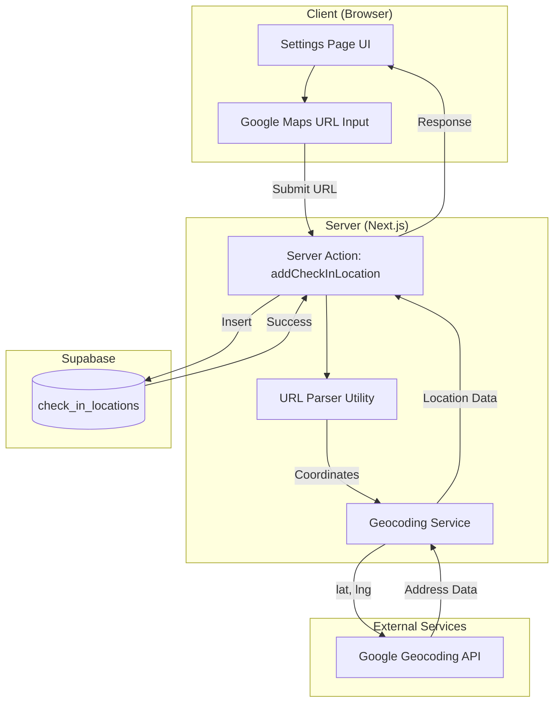

# Design Document: Office Location Management

## Overview

The Office Location Management feature enables HR administrators to add and manage office locations for GPS-based employee check-in validation. The system accepts Google Maps URLs, extracts coordinates using a URL parser, fetches detailed address information via the Google Geocoding API, and stores location data in the database.

The feature integrates with the existing Settings page UI and leverages the `check_in_locations` database table that has already been created.

## Architecture



## Components and Interfaces

### 1. URL Parser Utility (Existing: `lib/utils/googleMapsParser.ts`)

The existing parser already handles multiple URL formats. It will be enhanced to extract location names when available.

```typescript
interface ParsedLocation {
  latitude: number;
  longitude: number;
  label?: string;
}

function parseGoogleMapsUrl(url: string): ParsedLocation | null;
function generateGoogleMapsUrl(lat: number, lng: number, zoom?: number): string;
```

### 2. Geocoding Service (New: `lib/utils/geocoding.ts`)

Server-side service for reverse geocoding using Google Geocoding API.

```typescript
interface GeocodingResult {
  formattedAddress: string;
  addressComponents: {
    streetNumber?: string;
    street?: string;
    city?: string;
    state?: string;
    country?: string;
    postalCode?: string;
  };
}

async function reverseGeocode(
  latitude: number, 
  longitude: number
): Promise<GeocodingResult | null>;
```

### 3. Server Action (New: `lib/actions/hr/locations.ts`)

Server action for managing check-in locations.

```typescript
interface AddLocationInput {
  googleMapsUrl: string;
}

interface AddLocationResult {
  success: boolean;
  location?: CheckInLocation;
  error?: string;
  warning?: string;
}

async function addCheckInLocation(input: AddLocationInput): Promise<AddLocationResult>;
async function getCheckInLocations(): Promise<CheckInLocation[]>;
async function deleteCheckInLocation(id: string): Promise<{ success: boolean; error?: string }>;
async function toggleLocationActive(id: string, isActive: boolean): Promise<{ success: boolean; error?: string }>;
```

### 4. UI Components (Existing with modifications)

- `SettingsRightSection.tsx` - Already has the form and location list
- `CardOffice.tsx` - Already displays location cards with selection state

## Data Models

### CheckInLocation (Database Table - Already Exists)

```sql
CREATE TABLE check_in_locations (
    id UUID PRIMARY KEY DEFAULT gen_random_uuid(),
    name TEXT NOT NULL,
    latitude DECIMAL(10, 8) NOT NULL,
    longitude DECIMAL(11, 8) NOT NULL,
    radius_meters INTEGER NOT NULL DEFAULT 50,
    google_maps_url TEXT,
    is_active BOOLEAN NOT NULL DEFAULT TRUE,
    created_by UUID NOT NULL REFERENCES users(id),
    created_at TIMESTAMP WITH TIME ZONE NOT NULL DEFAULT NOW(),
    updated_at TIMESTAMP WITH TIME ZONE NOT NULL DEFAULT NOW()
);
```

### TypeScript Interface

```typescript
interface CheckInLocation {
  id: string;
  name: string;
  latitude: number;
  longitude: number;
  radiusMeters: number;
  googleMapsUrl: string | null;
  formattedAddress: string | null;
  isActive: boolean;
  createdBy: string;
  createdAt: string;
  updatedAt: string;
}
```

Note: The `formatted_address` column needs to be added to the existing table via migration.

## Correctness Properties

*A property is a characteristic or behavior that should hold true across all valid executions of a system-essentially, a formal statement about what the system should do. Properties serve as the bridge between human-readable specifications and machine-verifiable correctness guarantees.*

### Property 1: URL Parser Round-Trip Consistency
*For any* valid latitude and longitude coordinates, generating a Google Maps URL from those coordinates and then parsing that URL SHALL return coordinates equivalent to the original (within 6 decimal places precision).
**Validates: Requirements 8.1**

### Property 2: URL Format Parsing Correctness
*For any* valid Google Maps URL in supported formats (q=, @, ll=, /place/), the parser SHALL extract the correct latitude and longitude coordinates that match the values embedded in the URL.
**Validates: Requirements 4.1, 4.2, 4.3, 4.4**

### Property 3: Invalid URL Rejection
*For any* string that is not a valid Google Maps URL with extractable coordinates, the parser SHALL return null.
**Validates: Requirements 1.5**

### Property 4: Coordinate Precision Preservation
*For any* coordinates with up to 8 decimal places of precision, the parser SHALL preserve at least 6 decimal places of precision in the extracted values.
**Validates: Requirements 8.2**

### Property 5: Selection Mutual Exclusivity
*For any* list of office locations, selecting one location SHALL result in exactly one location being selected (all others deselected).
**Validates: Requirements 3.3**

### Property 6: Inactive Location Exclusion
*For any* location marked as inactive (is_active = false), that location SHALL NOT be included in the list of valid check-in locations for employees.
**Validates: Requirements 6.2**

### Property 7: Fallback Display for Missing Address
*For any* location stored without a formatted address, the display SHALL show the coordinates as a fallback representation.
**Validates: Requirements 7.3**

### Property 8: Location Card Information Completeness
*For any* office location displayed in the list, the rendered output SHALL contain the location name and either the formatted address or coordinate fallback.
**Validates: Requirements 2.2**

## Error Handling

### URL Parsing Errors
- Invalid URL format: Return `{ success: false, error: "Invalid Google Maps URL format" }`
- Missing coordinates: Return `{ success: false, error: "Could not extract coordinates from URL" }`

### Geocoding API Errors
- API failure: Store location without address, return `{ success: true, warning: "Address could not be retrieved" }`
- Rate limiting: Implement exponential backoff, return error after 3 retries

### Database Errors
- Duplicate location: Check for existing locations within 10m radius
- Permission denied: Return `{ success: false, error: "Permission denied" }`

## Testing Strategy

### Dual Testing Approach

This feature requires both unit tests and property-based tests to ensure comprehensive coverage.

### Unit Tests

Unit tests will cover:
- Specific URL format examples (one test per format)
- Geocoding API integration with mocked responses
- Server action happy path and error cases
- UI component rendering and interactions

### Property-Based Testing

Property-based tests will use **fast-check** library for TypeScript to verify universal properties.

Configuration:
- Minimum 100 iterations per property test
- Custom generators for valid coordinates and URL formats

Properties to implement:
1. Round-trip consistency (parse → generate → parse)
2. URL format parsing correctness
3. Invalid URL rejection
4. Coordinate precision preservation
5. Selection mutual exclusivity (UI state)
6. Inactive location exclusion (business logic)

Each property-based test MUST be tagged with:
```typescript
// **Feature: office-location-management, Property {number}: {property_text}**
```

### Test File Structure

```
lib/utils/__tests__/
  googleMapsParser.test.ts      # Unit tests
  googleMapsParser.property.ts  # Property-based tests
  geocoding.test.ts             # Unit tests with mocked API

lib/actions/hr/__tests__/
  locations.test.ts             # Server action tests
```
