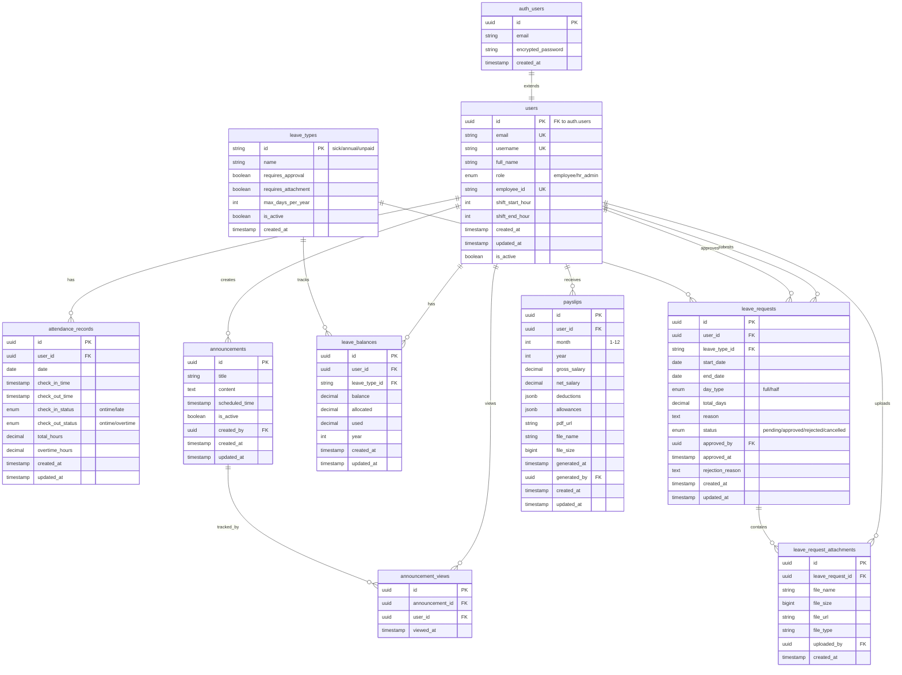

# MorvaHR Database Entity Relationship Diagram (ERD)

## Visual ERD



## Detailed Relationships

### 1. Users and Authentication
```
auth.users (1) ───extends──→ (1) users
```
- Each Supabase auth user has exactly one user profile
- User profile extends auth with application-specific data

### 2. User-Owned Records
```
users (1) ────────→ (0..N) attendance_records
users (1) ────────→ (0..N) leave_requests [as requester]
users (1) ────────→ (0..N) leave_balances
users (1) ────────→ (0..N) payslips
users (1) ────────→ (0..N) announcement_views
```
- Users own multiple records of attendance, leave requests, balances, and payslips
- Users can view multiple announcements

### 3. Administrative Relationships
```
users (1) ────────→ (0..N) announcements [as creator]
users (1) ────────→ (0..N) leave_requests [as approver]
users (1) ────────→ (0..N) leave_request_attachments [as uploader]
users (1) ────────→ (0..N) payslips [as generator]
```
- HR admins create announcements
- HR admins approve/reject leave requests
- Users upload attachments for their requests
- HR admins generate payslips

### 4. Leave Management
```
leave_types (1) ──→ (0..N) leave_requests
leave_types (1) ──→ (0..N) leave_balances
leave_requests (1) ──→ (0..N) leave_request_attachments
```
- Each leave type can have multiple requests and balances
- Each leave request can have multiple attachments

### 5. Announcements
```
announcements (1) ──→ (0..N) announcement_views
```
- Each announcement can be viewed by multiple users
- Tracks read status

## Cardinality Summary

| Relationship | Type | Description |
|-------------|------|-------------|
| auth.users → users | 1:1 | Each auth user has one profile |
| users → attendance_records | 1:N | User has many attendance records |
| users → leave_requests | 1:N | User submits many leave requests |
| users → leave_balances | 1:N | User has balances for each leave type/year |
| users → payslips | 1:N | User receives many payslips |
| users → announcements | 1:N | HR admin creates many announcements |
| users → announcement_views | 1:N | User views many announcements |
| leave_types → leave_requests | 1:N | Leave type used in many requests |
| leave_types → leave_balances | 1:N | Leave type tracked in many balances |
| leave_requests → attachments | 1:N | Request can have many attachments |
| announcements → views | 1:N | Announcement viewed by many users |

## Unique Constraints

| Table | Constraint | Purpose |
|-------|-----------|---------|
| users | (email) | One email per user |
| users | (username) | One username per user |
| users | (employee_id) | One employee ID per user |
| attendance_records | (user_id, date) | One record per user per day |
| leave_balances | (user_id, leave_type_id, year) | One balance per user per type per year |
| announcement_views | (announcement_id, user_id) | One view record per user per announcement |
| payslips | (user_id, month, year) | One payslip per user per month |

## Foreign Key Constraints

### ON DELETE Behaviors

| Relationship | ON DELETE | Rationale |
|-------------|-----------|-----------|
| users → attendance_records | CASCADE | Remove all records when user deleted |
| users → leave_requests | CASCADE | Remove leave requests when user deleted |
| users → leave_balances | CASCADE | Remove balances when user deleted |
| users → announcements | CASCADE | Remove announcements when creator deleted |
| users → announcement_views | CASCADE | Remove views when user deleted |
| users → payslips | CASCADE | Remove payslips when user deleted |
| leave_requests → attachments | CASCADE | Remove attachments when request deleted |
| announcements → views | CASCADE | Remove views when announcement deleted |
| leave_requests.approved_by → users | SET NULL | Keep request if approver deleted |
| payslips.generated_by → users | SET NULL | Keep payslip if generator deleted |

## Data Flow Examples

### 1. Leave Request Flow
```
Employee submits request
    ↓
leave_requests (status: pending)
    ↓
Employee uploads attachment
    ↓
leave_request_attachments
    ↓
HR Admin reviews
    ↓
leave_requests (status: approved/rejected)
    ↓
If approved: Update leave_balances
    ↓
(balance = balance - total_days)
```

### 2. Attendance Flow
```
Employee checks in
    ↓
attendance_records.check_in_time = NOW()
    ↓
System calculates check_in_status
    ↓
Employee checks out
    ↓
attendance_records.check_out_time = NOW()
    ↓
System calculates total_hours & overtime_hours
```

### 3. Payslip Flow
```
HR Admin generates payslip
    ↓
Create PDF in Supabase Storage
    ↓
payslips record created
    ↓
Employee downloads via app
```

## Index Strategy

### Primary Indexes (for foreign keys)
- All `user_id` columns
- All `leave_request_id`, `announcement_id` columns
- Date-based queries (attendance.date, leave_requests.start_date)

### Composite Indexes (for common queries)
- `(user_id, date)` on attendance_records
- `(user_id, status)` on leave_requests
- `(user_id, leave_type_id, year)` on leave_balances
- `(user_id, year, month)` on payslips

### Lookup Indexes
- `email` and `username` on users
- `role` on users for RLS queries
- `is_active` on announcements and leave_types

## Notes

1. **Soft Deletes**: Consider adding `deleted_at` columns for audit trails
2. **Audit Trail**: Could add separate audit tables to track all changes
3. **Normalization**: Schema is in 3NF with proper normalization
4. **JSONB Usage**: `deductions` and `allowances` in payslips use JSONB for flexibility
5. **Timestamps**: All use `TIMESTAMP WITH TIME ZONE` for UTC storage

## Tools for Visualization

This ERD can be visualized using:
- **Mermaid Live Editor**: https://mermaid.live/
- **dbdiagram.io**: Import schema and generate ERD
- **DBeaver**: Connect to Supabase and generate ER diagram
- **pgAdmin**: Built-in ERD tool
- **Supabase Studio**: Visual schema editor

## Schema Version

- Version: 1.0.0
- Created: 2025-01-07
- Database: PostgreSQL 15+ (Supabase)


