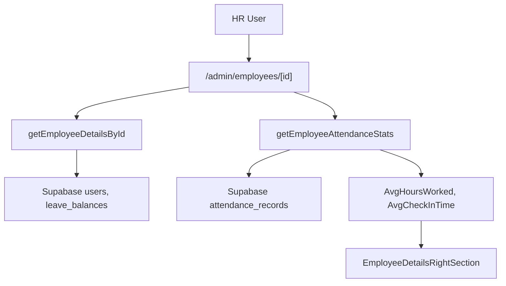

# Implement Attendance Statistics on Employee Details Page

## Goal

Add **real backend-driven statistics** for **Avg. Hours Worked** and **Avg. Check-In Time** on the employee details page, using `attendance_records` data instead of mocked values.

## High-level Architecture

- **Backend**: New server action `getEmployeeAttendanceStats` in [`lib/actions/hr/employeeDetails.ts`](lib/actions/hr/employeeDetails.ts) that aggregates over `attendance_records`.
- **Frontend**: Extend [`EmployeeDetailsRightSection.tsx`](components/hr/employee/EmployeeDetailsRightSection.tsx) to consume real stats instead of hard-coded values.

## Steps

### 1. Design statistics contract

- **Add types** in [`lib/actions/hr/employeeDetails.ts`](lib/actions/hr/employeeDetails.ts):
  - `EmployeeAttendanceStats = { avgHoursWorked: number | null; avgCheckInTimeMinutes: number | null; periodLabel: string }`.
  - Update `EmployeeDetailsResult` to optionally include `attendanceStats?: EmployeeAttendanceStats` for future use if needed.
- **Decide period** (sensible default):
  - Use **last 30 days** or **current calendar month**, excluding days without a completed check-out for avg hours, and days without check-in for avg check-in time.
  - Represent the chosen period in `periodLabel` (e.g. `"Last 30 days"`).

### 2. Implement `getEmployeeAttendanceStats` server action

- In [`lib/actions/hr/employeeDetails.ts`](lib/actions/hr/employeeDetails.ts), below `getEmployeeActivities`, add:
  - `export async function getEmployeeAttendanceStats(employeeId: string): Promise<{ data?: EmployeeAttendanceStats; error?: string }>`.
- Logic (Postgres best practices based on Supabase/SQL docs):
  - Use `requireHRAdmin()` at the top to ensure only HR can fetch stats.
  - Compute **date range** in GMT+7 using existing timezone utilities (`getNowPartsInGMT7`, `formatDateISO` or `getTodayDateString`) to avoid timezone drift.
  - Query `attendance_records` once with a **WHERE user_id = employeeId AND date BETWEEN startDate AND endDate` filter.
  - For **average hours worked**:
    - Use `AVG(total_hours)` in SQL via `supabase.rpc` or `select`+aggregate in JS, only on rows where `total_hours IS NOT NULL`.
  - For **average check-in time**:
    - Convert `check_in_time` to **minutes from midnight local (WIB)**.
    - Either:
      - Do it in SQL: `EXTRACT(HOUR FROM check_in_time AT TIME ZONE 'Asia/Bangkok')*60 + EXTRACT(MINUTE FROM check_in_time AT TIME ZONE 'Asia/Bangkok')`, then take `AVG(...)`, or
      - Fetch rows and compute in JS using `Intl.DateTimeFormat` with `APP_TIMEZONE` (consistent with the rest of the app).
    - Ignore rows where `check_in_time IS NULL`.
  - Round results appropriately (e.g. 2 decimal places for hours, nearest minute for time).
  - Return `{ data: { avgHoursWorked, avgCheckInTimeMinutes, periodLabel } }` or an `error` string on failure.

### 3. Add helper to format average check-in time for UI

- In [`lib/actions/hr/employeeDetails.ts`](lib/actions/hr/employeeDetails.ts) or a small utility file (e.g. [`lib/utils/attendanceStats.ts`](lib/utils/attendanceStats.ts)):
  - Add a pure helper to convert `avgCheckInTimeMinutes` (e.g. 665) into a display pair `{ time: '11:05', meridiem: 'AM' }`.
  - Use 24h → 12h conversion and zero-padding minutes.
- This keeps server action focused on numbers while the UI decides exact formatting.

### 4. Extend `EmployeeDetailsRightSection` to use real stats

- In [`components/hr/employee/EmployeeDetailsRightSection.tsx`](components/hr/employee/EmployeeDetailsRightSection.tsx):
  - Decide where stats are fetched:
    - **Option A (simpler, initial)**: Keep it as a client component that **calls a new server action** `getEmployeeAttendanceStats(employeeId)` inside the existing `useEffect`, in parallel with `getEmployeeActivities`.
    - **Option B (more server-driven)**: In the parent page server component, fetch both `getEmployeeDetailsById` and `getEmployeeAttendanceStats` and pass stats down as props. (Can be a later refactor.)
  - For now, use **Option A**:
    - Add `const [stats, setStats] = useState<EmployeeAttendanceStats | null>(null); `and optionally a separate loading/error for stats, or reuse the existing `loading`/`error` if you want a single state.
    - In `useEffect`, `Promise.all` the two calls (`getEmployeeActivities`, `getEmployeeAttendanceStats`) so they load in parallel.
    - On success, set both `activities` and `stats`.
  - Replace the hard-coded values:
    - `totalHoursWorked` → derived from `stats?.avgHoursWorked` (e.g. `stats ? stats.avgHoursWorked.toFixed(1) : '--'`).
    - `avgCheckInTime` + `unit="AM"` → replace with formatted `time` and dynamic AM/PM from the helper; fallback to `'--'` if no data yet.
    - Optionally display `stats.periodLabel` in the `comparison` text instead of generic `"vs last month"`.

### 5. Handle loading, empty, and error states gracefully

- **Loading**:
  - Keep the existing spinner while either activities or stats are loading.
- **Empty data**:
  - If there are **no attendance records** in the period, show a neutral value such as `"0"` hours and `"--"` check-in time, or a label like `"No data"` in the widget subtitle.
- **Errors**:
  - If stats fail but activities succeed, you can:
    - Show an inline error message for stats, or
    - Log to console and keep the widgets with `"--"` values so the rest of the page works.

### 6. Optional: HR dashboard-level stats reuse

- If later you want **global** stats (e.g. average hours across all employees) on the HR dashboard:
  - Extract the core aggregation logic into a shared helper (e.g. [`lib/actions/hr/attendanceStats.ts`](lib/actions/hr/attendanceStats.ts)), parameterized by `user_id` or `NULL` for all users.
  - Reuse it from both `getEmployeeAttendanceStats` and `getHRDashboardStats` (if you choose to extend that).

### 7. Testing checklist

- With real data in `attendance_records`:
  - **Single employee** with several days of check-in/check-out:
    - Confirm `total_hours` is populated on check-out and the average matches manual calculation.
    - Confirm the average check-in time matches the mean of actual days (spot-check a few records).
  - **Edge cases**:
    - Days with check-in but **no check-out** (ignore for hours, but should still count for check-in average if you choose).
    - Employee with **no attendance records** in the period.
    - Timezone sanity: a known 11:00 WIB check-in should always display as `11:00 AM` regardless of server time zone.

### 8. Future enhancements (optional)

- Allow HR to **change the period** (e.g. last 7 days / 30 days / this month) via a dropdown; pass the selected period to `getEmployeeAttendanceStats`.
- Add more advanced stats: percentage of late days, average overtime, etc., by reusing the same pattern of aggregating over `attendance_records`.