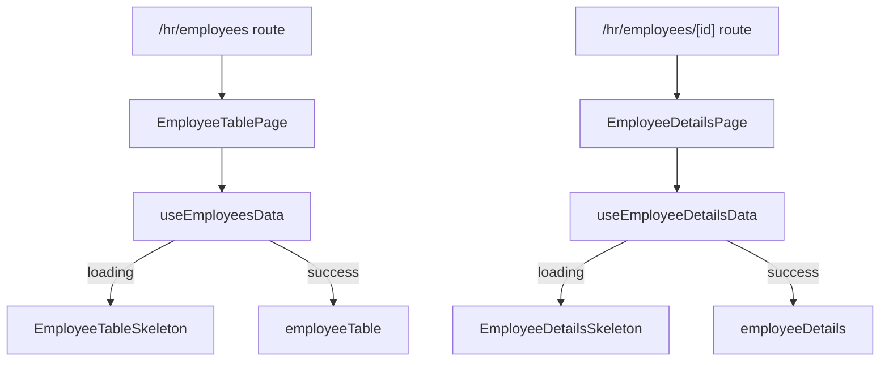

# Skeleton Loading for Employee Table & Employee Details Page

### Goals

- **Unify loading experience** across HR app by adding skeletons for the employee table and employee details page that visually match existing skeletons (e.g. recent activities, dashboard panels).
- **Preserve layout stability** so table columns, cards, and panels do not shift when real data arrives.
- **Reuse patterns** from existing skeleton components (colors, border radius, animation, spacing) instead of introducing new visual language.

### High-Level Architecture

- **Loading decision** stays in the page-level component (or a dedicated client wrapper) using existing data hooks or `SWR`/`react-query`/custom fetch logic.
- **Skeleton components** are dumb/presentational; they take minimal props (e.g. row count) and just mirror layout.

### Step 1: Audit Existing Skeleton Patterns

- **Inspect existing skeletons**:
  - `components/hr/dashboard/RecentActivitiesSkeleton.tsx`
  - Any other `*Skeleton.tsx` files (e.g. for cards, lists, or charts).
- **Extract conventions**:
  - **Color tokens** (likely neutral background like `bg-neutral-100` / `bg-neutral-200`).
  - **Animation** (e.g. `animate-pulse`).
  - **Spacing & radius** (e.g. `rounded-lg`, `gap-3`, consistent padding).
  - **Structure** (use of stacked `div`s matching final layout, not generic bars).
- **Document a mini guideline** in comments or internal doc (e.g. in `RecentActivitiesSkeleton.tsx` or a short `SKELETON_GUIDE.md`) so future skeletons follow the same style.

### Step 2: Design Skeleton Layouts

- **Employee Table Skeleton**
  - Mirror the employee table header & row structure from the HR employee list page (e.g. `[app/(hr)/hr/employees/page.tsx]` or equivalent table component).
  - For each visible column (avatar, name, role, status, actions):
    - Use fixed-width gray blocks with the same approximate width as content.
    - Keep row height identical to real rows.
  - Number of skeleton rows: configurable via prop (e.g. `rows=5`), default ~5–8.

- **Employee Details Skeleton**
  - Mirror the two-column layout used by the real page (left profile / right activity & stats):
    - **Left column**: avatar circle skeleton, name/role lines, info rows, and bank details card with line placeholders.
    - **Right column**: statistic widgets placeholder (four small cards) and activity feed grouped sections with line blocks.
  - Respect existing gaps (e.g. `gap-[28px]`, `gap-6`) and card padding so height/width match final content.

### Step 3: Implement `EmployeeTableSkeleton`

- **Create component** `components/hr/employees/EmployeeTableSkeleton.tsx`:
  - Accept props like `{ rows?: number }`.
  - Render:
    - Static table header matching actual columns (optionally with light gray background, but not animated).
    - `rows` number of `<tr>` (or flex rows) each containing `div` placeholders with `animate-pulse`, neutral backgrounds, and radius.
  - Follow patterns from `RecentActivitiesSkeleton` for animation and colors.

- **Integrate into employee list page** (e.g. `[app/(hr)/hr/employees/page.tsx]` or current HR employees route):
  - Use existing data hook or fetch logic; if not yet abstracted, create `useEmployeesTableData` that returns `{ data, isLoading, error }`.
  - In JSX, conditionally render:
    - `isLoading` → `<EmployeeTableSkeleton rows={6} />`
    - `!isLoading && data` → existing table component.
  - Ensure container height remains similar so there is no layout jump when data arrives.

### Step 4: Implement `EmployeeDetailsSkeleton`

- **Create component** `components/hr/employee/EmployeeDetailsSkeleton.tsx`:
  - Match the grid structure of the employee details page route that replaced the old test page.
  - **Left section structure**:
    - Card container with:
      - Top row: circular avatar skeleton (`h-16 w-16 rounded-full`) and two name/role bars.
      - Info list: repeated rows with label stub and value stub (short/long bars).
      - Bank card: rectangle placeholder with two columns of line items.
  - **Right section structure**:
    - Statistic widgets area: grid of 3–4 equal-width cards, each with a title bar and value bar.
    - Activity feed: for 2–3 groups, include a group header bar and 2–3 activity row placeholders with icon circle + text bars.
  - Use `animate-pulse` on major groups, not on every child div to avoid performance issues.

- **Integrate into employee details page** (current production route for `[id]`):
  - Wrap data fetching for employee profile, statistics, and activities in a single hook (e.g. `useEmployeeDetails(id)`) if not already present, returning `isLoading`.
  - In the page component, conditionally render:
    - `isLoading` → `<EmployeeDetailsSkeleton />`
    - `!isLoading && data` → existing left/right detail components.
  - If some subsections load independently (e.g. activities separate from profile), consider section-level skeletons in addition to a full-page skeleton.

### Step 5: Align with Existing Skeletons & Theming

- **Visual alignment**:
  - Reuse the exact Tailwind classes from `RecentActivitiesSkeleton` for colors (`bg-neutral-100`, `bg-neutral-200`), animation (`animate-pulse`), and shadows (if any).
  - Keep border radii (`rounded-lg`, `rounded-xl`) and spacing (`gap-3`, `px-4`, `py-3`) consistent with cards/tables used elsewhere.
- **Theming support**:
  - Ensure skeleton colors respect dark mode/theming if present (e.g. conditional classes or CSS variables already used in other skeletons).
- **Accessibility**:
  - Mark skeleton containers with `aria-busy="true"` and `aria-live="polite"` where appropriate.
  - Avoid using `role="status"` on every row; prefer one high-level container.

### Step 6: Testing & UX Validation

- **Manual testing**:
  - Throttle network via browser dev tools and verify both table and details skeletons appear and disappear smoothly.
  - Confirm there is no layout shift when data replaces skeletons (same widths & heights).
- **Cross-page consistency**:
  - Compare against existing dashboard skeletons side-by-side to ensure the shimmer, colors, and density feel like part of the same design system.
- **Edge cases**:
  - Verify behavior when `error` occurs: skeleton should not persist; instead show existing error state.
  - Confirm that fast responses either briefly show skeletons (acceptable) or skip them if you use heuristics (optional refinement).

### Optional Refinements

- **Extract shared skeleton primitives** in `components/shared/skeleton/` (e.g. `SkeletonLine`, `SkeletonCircle`, `SkeletonCard`) used by all skeleton components to further centralize styling.
- **Integrate with Suspense** in the future by using `<Suspense fallback={<EmployeeTableSkeleton />}>` around table/detail components once data fetching is compatible.