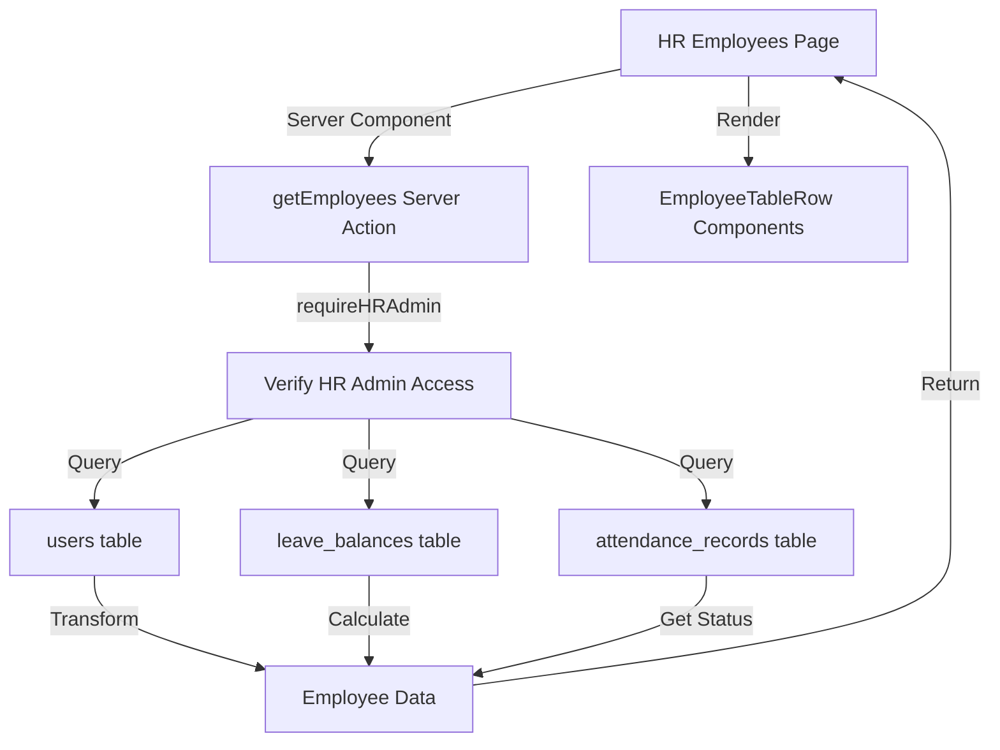

# Fetch Employee Data from Database - Implementation Plan

## Overview

Replace hardcoded sample data in the HR employees page with real database queries. The implementation will fetch employee data from Supabase, calculate leave balances, get attendance status, and transform the data to match the existing `Employee` interface.

## Architecture



## Implementation Steps

### Phase 1: Create Server Action for Fetching Employees

**File**: `lib/actions/hr/employees.ts` (new file)

Create a new server action file that will:

- Use `requireHRAdmin()` to verify HR admin access
- Query the `users` table for all employees (role = 'employee', is_active = true)
- Join with `leave_balances` table to get current year leave balance
- Query `attendance_records` for today's attendance status
- Transform database fields to match the `Employee` interface

**Key Functions**:

1. `getEmployees()` - Main function to fetch and transform employee data

   - Query users table with filters: `role = 'employee'`, `is_active = true`
   - Select fields: `id, email, username, full_name, profile_picture_url, birthdate, employment_type, contract_start_date, contract_end_date`
   - Order by `full_name` for consistent sorting
   - Use parallel queries for leave balances and attendance records

2. **Data Transformation**:

   - Map `full_name` → `name`
   - Map `profile_picture_url` → `imageUrl`
   - Map `employment_type` → `role` ('intern' → 'Intern', 'full_time' → 'Full-time', etc.)
   - Format `birthdate` → `birthDate` (e.g., "10 December 2001")
   - Format `contract_start_date` and `contract_end_date` → `contractPeriod` (e.g., "8 Sep - 8 Dec 2025")
   - Calculate `leaveBalance` from `leave_balances` table (sum of all leave types for current year)
   - Get `status` from `attendance_records` for today's date

3. **Leave Balance Calculation**:

   - Query `leave_balances` table for current year
   - Sum `balance` across all leave types for each employee
   - Default to `{ current: 0, total: 0 }` if no leave balance found
   - Consider using a default total (e.g., 10 days) if not specified

4. **Attendance Status**:

   - Query `attendance_records` for today's date
   - Check if `check_in_time` exists → "Checked in" with `isActive: true`
   - Check if `check_out_time` exists → "Checked out" with `isActive: false`
   - Default to "Not checked in" with `isActive: false` if no record

**Error Handling**:

- Return `{ data?: Employee[], error?: string }` pattern
- Log errors with context
- Handle missing/null fields gracefully

### Phase 2: Update Employees Page to Use Server Component

**File**: `app/(admin)/admin/employees/page.tsx` (or `app/(hr)/hr/employees/page.tsx` if it exists)

Convert from client component to server component:

1. Remove `'use client'` directive
2. Make the component `async`
3. Call `getEmployees()` server action at the top
4. Handle loading and error states
5. Pass fetched data to a new client component for interactivity

**Structure**:

```typescript
export default async function EmployeesPage() {
  const employeesResult = await getEmployees();
  
  if (employeesResult.error) {
    // Handle error (redirect or show error message)
  }
  
  return <EmployeesPageClient employees={employeesResult.data || []} />;
}
```

### Phase 3: Create Client Component for Interactivity

**File**: `components/hr/employees/EmployeesPageClient.tsx` (new file)

Extract all client-side interactivity to a separate component:

- State management (search, filters, selection)
- Event handlers
- Modal state
- All existing client-side logic from current page

This component will receive `employees` as props and handle all UI interactions.

### Phase 4: Data Mapping and Formatting Utilities

**File**: `lib/utils/employeeTransform.ts` (new file)

Create utility functions for data transformation:

1. `formatBirthDate(date: string | null): string` - Format date to "DD Month YYYY"
2. `formatContractPeriod(start: string | null, end: string | null): string` - Format to "DD MMM - DD MMM YYYY"
3. `mapEmploymentTypeToRole(type: string | null): RoleBadgeVariant` - Map 'intern' → 'Intern', 'full_time' → 'Full-time'
4. `getAttendanceStatus(attendanceRecord: any): { label: string; isActive: boolean }` - Determine status from attendance record

### Phase 5: Optimize Queries with Parallel Fetching

Use `Promise.all()` to fetch data in parallel:

- Users query
- Leave balances query (for all employees)
- Attendance records query (for today, all employees)

Then join the data in memory for better performance.

### Phase 6: Handle Edge Cases

1. **Missing Data**:

   - Handle null `birthdate`, `contract_start_date`, `contract_end_date`
   - Default `profile_picture_url` to null (Avatar component handles this)
   - Default `employment_type` to 'full_time' if null

2. **Leave Balance**:

   - If no leave balance record exists, default to `{ current: 0, total: 10 }`
   - Sum balances across all leave types

3. **Attendance**:

   - If no attendance record for today, show "Not checked in"
   - Handle multiple attendance records (shouldn't happen due to unique constraint)

## Files to Create/Modify

### New Files:

1. `lib/actions/hr/employees.ts` - Server action for fetching employees
2. `components/hr/employees/EmployeesPageClient.tsx` - Client component for interactivity
3. `lib/utils/employeeTransform.ts` - Data transformation utilities

### Modified Files:

1. `app/(admin)/admin/employees/page.tsx` - Convert to server component
2. `lib/actions/hr/index.ts` - Export `getEmployees` function (if index file exists)

## Database Queries

### Main Query (users table):

```sql
SELECT 
  id, email, username, full_name, profile_picture_url, 
  birthdate, employment_type, contract_start_date, contract_end_date
FROM users
WHERE role = 'employee' AND is_active = true
ORDER BY full_name;
```

### Leave Balance Query:

```sql
SELECT user_id, SUM(balance) as total_balance, SUM(allocated) as total_allocated
FROM leave_balances
WHERE year = EXTRACT(YEAR FROM CURRENT_DATE)
GROUP BY user_id;
```

### Attendance Query:

```sql
SELECT user_id, check_in_time, check_out_time
FROM attendance_records
WHERE date = CURRENT_DATE;
```

## Type Safety

- Use existing `Database` types from `lib/supabase/types.ts`
- Ensure `Employee` interface matches transformed data
- Add type guards for null checks

## Performance Considerations

- Use parallel queries with `Promise.all()`
- Consider caching leave balances (they don't change frequently)
- Limit attendance query to today's date only
- Use database indexes (already exist: `idx_users_role`, `idx_users_is_active`)

## Security

- All queries go through `requireHRAdmin()` which verifies HR admin role
- RLS policies ensure only HR admins can read all users
- No sensitive data exposed to client (service role key never used)

## Testing Checklist

- [ ] Verify HR admin can fetch employees
- [ ] Verify non-HR admin cannot access (should throw error)
- [ ] Test with employees having no leave balance
- [ ] Test with employees having no attendance record
- [ ] Test date formatting for various date formats
- [ ] Test employment type mapping
- [ ] Verify sorting by full_name works
- [ ] Test error handling for database errors