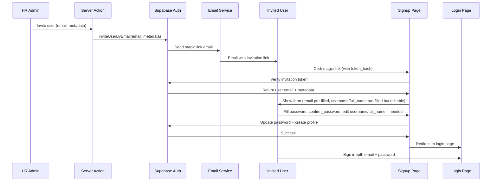

# User Invitation with Signup Page Flow - Best Practices Plan

## Overview

Automate the process of inviting new employees to create accounts using Supabase magic link invitations. When users click the invitation link, they are redirected to a protected signup page where they complete their profile (username, full name, password) before being redirected to login.

This plan incorporates best practices from Supabase documentation, Next.js patterns, and security guidelines.

## Architecture

### Flow Diagram



### Key Design Decisions

**Signup Page Protection**
- Signup page is **only accessible via invitation link**
- Requires `token_hash` and `type=invite` query parameters
- Redirects to login if accessed without valid invitation
- Email is automatically extracted from verified token

**Form Fields**
- **Email**: Auto-extracted from token, displayed but disabled (read-only)
- **Username**: Pre-filled from invitation metadata (if provided), editable
- **Full Name**: Pre-filled from invitation metadata (if provided), editable
- **Password**: User must enter (validated per Supabase security best practices)
- **Confirm Password**: User must enter (must match password)

**Post-Submission Flow**
- User password is updated in Supabase Auth
- User profile is created/updated in `users` table
- User is redirected to login page (not auto-logged in)
- User must sign in with email and password

## Phase 1: Server Action for Inviting Users

### 1.1 Create Invite User Server Action

**File**: `lib/actions/hr/users.ts` (new file)

**Function**: `inviteUserByEmail()`

**Best Practices** (from Supabase documentation):
- Use service role client for admin operations (bypasses RLS)
- Validate email format before sending invitation
- Check for duplicate emails in both `auth.users` and `public.users` tables
- Store metadata in `data` parameter for profile pre-filling
- Use proper error handling with descriptive messages
- Log invitation attempts for audit purposes

**Requirements**:
- Only HR admins can invite users (enforced via `requireHRAdmin`)
- Use service role client for admin operations
- Accept user metadata (full_name, username, employee_id, role, etc.)
- Handle duplicate email errors gracefully
- Return success/error status
- Redirect to signup page (not accept-invite)

**Implementation**:
```typescript
'use server';

import { createServiceRoleClient } from '@/lib/supabase/server';
import { requireHRAdmin } from '@/lib/auth/server';

export interface InviteUserData {
  email: string;
  full_name: string;
  username: string;
  employee_id?: string;
  role?: 'employee' | 'hr_admin';
  shift_start_hour?: number;
  shift_end_hour?: number;
}

export async function inviteUserByEmail(
  userData: InviteUserData
): Promise<{ success: boolean; error?: string; userId?: string }> {
  try {
    // Verify HR admin access
    await requireHRAdmin();
    
    // Get service role client for admin operations
    const supabase = createServiceRoleClient();
    if (!supabase) {
      return { success: false, error: 'Service role key not configured' };
    }
    
    // Check if user already exists
    const { data: existingUser } = await supabase
      .from('users')
      .select('id, email')
      .eq('email', userData.email)
      .single();
    
    if (existingUser) {
      return { success: false, error: 'User with this email already exists' };
    }
    
    // Invite user via Supabase Auth Admin API
    const { data: authUser, error: inviteError } = await supabase.auth.admin.inviteUserByEmail(
      userData.email,
      {
        redirectTo: `${process.env.NEXT_PUBLIC_SITE_URL || 'http://localhost:3000'}/signup`,
        data: {
          full_name: userData.full_name,
          username: userData.username,
          employee_id: userData.employee_id,
          role: userData.role || 'employee',
        },
      }
    );
    
    if (inviteError) {
      console.error('[inviteUserByEmail] Invite error:', inviteError);
      return { success: false, error: inviteError.message };
    }
    
    if (!authUser?.user) {
      return { success: false, error: 'Failed to create user' };
    }
    
    // Create user profile in database (will be created by trigger, but we can pre-populate)
    // Note: The database trigger will handle this automatically after user accepts invite
    // But we can create a placeholder record here if needed
    
    return { 
      success: true, 
      userId: authUser.user.id 
    };
  } catch (error) {
    const errorMessage = error instanceof Error ? error.message : String(error);
    console.error('[inviteUserByEmail] Error:', errorMessage);
    return { success: false, error: errorMessage };
  }
}
```

## Phase 2: Database Trigger for Auto Profile Creation

### 2.1 Create Database Trigger Function

**File**: `database/migrations/[timestamp]_create_user_profile_trigger.sql`

**Purpose**: Automatically create user profile in `users` table when user accepts invitation

**Implementation**:
```sql
-- Function to create user profile when auth user is created
CREATE OR REPLACE FUNCTION public.handle_new_user()
RETURNS TRIGGER AS $$
DECLARE
  v_username TEXT;
  v_full_name TEXT;
  v_employee_id TEXT;
  v_role user_role := 'employee';
BEGIN
  -- Extract metadata from user_metadata
  v_full_name := COALESCE(NEW.raw_user_meta_data->>'full_name', '');
  v_username := COALESCE(NEW.raw_user_meta_data->>'username', '');
  v_employee_id := NEW.raw_user_meta_data->>'employee_id';
  
  -- Set role from metadata or default to employee
  IF NEW.raw_user_meta_data->>'role' = 'hr_admin' THEN
    v_role := 'hr_admin';
  END IF;
  
  -- Generate username from email if not provided
  IF v_username = '' THEN
    v_username := split_part(NEW.email, '@', 1);
  END IF;
  
  -- Generate full_name from email if not provided
  IF v_full_name = '' THEN
    v_full_name := INITCAP(REPLACE(split_part(NEW.email, '@', 1), '.', ' '));
  END IF;
  
  -- Insert into users table
  INSERT INTO public.users (
    id,
    email,
    username,
    full_name,
    role,
    employee_id,
    shift_start_hour,
    shift_end_hour,
    created_at,
    updated_at,
    is_active
  ) VALUES (
    NEW.id,
    NEW.email,
    v_username,
    v_full_name,
    v_role,
    v_employee_id,
    COALESCE((NEW.raw_user_meta_data->>'shift_start_hour')::INTEGER, 11),
    COALESCE((NEW.raw_user_meta_data->>'shift_end_hour')::INTEGER, 19),
    NOW(),
    NOW(),
    TRUE
  )
  ON CONFLICT (id) DO NOTHING; -- Prevent duplicate inserts
  
  RETURN NEW;
END;
$$ LANGUAGE plpgsql SECURITY DEFINER;

-- Create trigger on auth.users
CREATE TRIGGER on_auth_user_created
  AFTER INSERT ON auth.users
  FOR EACH ROW
  EXECUTE FUNCTION public.handle_new_user();

-- Grant necessary permissions
GRANT USAGE ON SCHEMA public TO postgres, anon, authenticated, service_role;
GRANT ALL ON public.users TO postgres, service_role;
```

## Phase 3: Protected Signup Page with Form Validation

### 3.1 Create Protected Signup Page

**File**: `app/(auth)/signup/page.tsx` (new file or update existing)

**Best Practices** (from Next.js and Supabase documentation):
- Use React `useActionState` hook for form state management
- Implement server-side validation with Zod schema
- Use `safeParse` for validation to handle errors gracefully
- Display field-specific errors inline
- Show password requirements clearly
- Implement proper loading and pending states
- Use `aria-live` regions for accessibility

**Purpose**: Handle user after they click the magic link invitation - redirect to signup page

**Flow**:
1. **Access Control**: Verify `token_hash` and `type=invite` query parameters on page load
2. **Token Verification**: Verify invitation token and extract email + metadata
3. **Form Display**: Show signup form with pre-filled values (email disabled, username/full_name editable)
4. **Form Submission**: Validate form, update password, create/update profile
5. **Redirect**: Redirect to login page after successful signup

**Form Fields**:
- Email (disabled, auto-filled from token)
- Username (editable, pre-filled from metadata)
- Full Name (editable, pre-filled from metadata)
- Password (required, with validation)
- Confirm Password (required, must match password)

**Implementation Pattern** (following Next.js best practices):

**Step 1: Create Zod Schema for Validation**

**File**: `lib/validations/signup.ts` (new file)

```typescript
import { z } from 'zod';

export const SignupFormSchema = z.object({
  email: z.string().email({ message: 'Invalid email address' }),
  username: z
    .string()
    .min(3, { message: 'Username must be at least 3 characters' })
    .max(50, { message: 'Username must be less than 50 characters' })
    .regex(/^[a-zA-Z0-9_]+$/, { message: 'Username can only contain letters, numbers, and underscores' }),
  full_name: z
    .string()
    .min(2, { message: 'Full name must be at least 2 characters' })
    .max(100, { message: 'Full name must be less than 100 characters' }),
  password: z
    .string()
    .min(8, { message: 'Password must be at least 8 characters' })
    .regex(/[A-Z]/, { message: 'Password must contain at least one uppercase letter' })
    .regex(/[a-z]/, { message: 'Password must contain at least one lowercase letter' })
    .regex(/[0-9]/, { message: 'Password must contain at least one number' })
    .regex(/[!@#$%^&*()_+\-=\[\]{};':"\\|,.<>\/?]/, { message: 'Password must contain at least one symbol' }),
  confirm_password: z.string(),
}).refine((data) => data.password === data.confirm_password, {
  message: "Passwords don't match",
  path: ['confirm_password'],
});

export type SignupFormData = z.infer<typeof SignupFormSchema>;
```

**Step 2: Create Server Action for Signup**

**File**: `lib/actions/auth/signup.ts` (new file)

```typescript
'use server';

import { SignupFormSchema, type SignupFormData } from '@/lib/validations/signup';
import { createClient } from '@/lib/supabase/server';
import { redirect } from 'next/navigation';

export interface SignupFormState {
  errors?: {
    email?: string[];
    username?: string[];
    full_name?: string[];
    password?: string[];
    confirm_password?: string[];
    _form?: string[];
  };
  message?: string;
}

export async function signup(
  prevState: SignupFormState | undefined,
  formData: FormData
): Promise<SignupFormState> {
  // Validate form fields
  const validatedFields = SignupFormSchema.safeParse({
    email: formData.get('email'),
    username: formData.get('username'),
    full_name: formData.get('full_name'),
    password: formData.get('password'),
    confirm_password: formData.get('confirm_password'),
  });

  // If any form fields are invalid, return early
  if (!validatedFields.success) {
    return {
      errors: validatedFields.error.flatten().fieldErrors,
    };
  }

  const { email, username, full_name, password } = validatedFields.data;
  const tokenHash = formData.get('token_hash') as string;

  if (!tokenHash) {
    return {
      errors: {
        _form: ['Invalid invitation token. Please use the link from your invitation email.'],
      },
    };
  }

  try {
    const supabase = await createClient();

    // Verify invitation token to get session
    const { data: verifyData, error: verifyError } = await supabase.auth.verifyOtp({
      token_hash: tokenHash,
      type: 'invite',
    });

    if (verifyError || !verifyData.session) {
      return {
        errors: {
          _form: ['Invalid or expired invitation token. Please request a new invitation.'],
        },
      };
    }

    // Update user password
    const { error: updateError } = await supabase.auth.updateUser({
      password: password,
    });

    if (updateError) {
      return {
        errors: {
          _form: [updateError.message],
        },
      };
    }

    // Get current user
    const { data: { user }, error: userError } = await supabase.auth.getUser();
    if (userError || !user) {
      return {
        errors: {
          _form: ['Failed to get user information'],
        },
      };
    }

    // Create or update user profile
    const { error: profileError } = await supabase
      .from('users')
      .upsert({
        id: user.id,
        email: email,
        username: username.trim(),
        full_name: full_name.trim(),
        role: user.user_metadata?.role || 'employee',
        employee_id: user.user_metadata?.employee_id || null,
        shift_start_hour: user.user_metadata?.shift_start_hour || 11,
        shift_end_hour: user.user_metadata?.shift_end_hour || 19,
        updated_at: new Date().toISOString(),
      }, {
        onConflict: 'id',
      });

    if (profileError) {
      console.error('[signup] Profile creation error:', profileError);
      return {
        errors: {
          _form: ['Failed to create user profile. Please contact support.'],
        },
      };
    }

    // Success - redirect to login
    redirect('/login?message=Account created successfully. Please sign in.');
  } catch (error) {
    console.error('[signup] Unexpected error:', error);
    return {
      errors: {
        _form: ['An unexpected error occurred. Please try again.'],
      },
    };
  }
}
```

**Step 3: Create Signup Page Component**

**File**: `app/(auth)/signup/page.tsx`

```typescript
'use client';

import { useEffect, useState } from 'react';
import { useRouter, useSearchParams } from 'next/navigation';
import { useActionState } from 'react';
import { createClient } from '@/lib/supabase/client';
import { signup } from '@/lib/actions/auth/signup';
import FormInput from '@/components/shared/FormInput';
import ButtonLarge from '@/components/shared/ButtonLarge';

export default function SignUpPage() {
  const router = useRouter();
  const searchParams = useSearchParams();
  const [state, formAction, pending] = useActionState(signup, undefined);
  const [isVerifying, setIsVerifying] = useState(true);
  const [email, setEmail] = useState('');
  const [username, setUsername] = useState('');
  const [fullName, setFullName] = useState('');
  const [tokenHash, setTokenHash] = useState<string | null>(null);

  // Verify invitation token and extract email on mount
  useEffect(() => {
    async function verifyInvitation() {
      const hash = searchParams.get('token_hash');
      const type = searchParams.get('type');

      // Signup page is only accessible via invitation
      if (!hash || type !== 'invite') {
        router.replace('/login?error=invalid_invitation');
        return;
      }

      try {
        const supabase = createClient();
        const { data, error: verifyError } = await supabase.auth.verifyOtp({
          token_hash: hash,
          type: 'invite',
        });

        if (verifyError || !data.user) {
          router.replace('/login?error=expired_invitation');
          return;
        }

        // Extract email and metadata
        setEmail(data.user.email || '');
        setTokenHash(hash);
        
        const metadata = data.user.user_metadata;
        if (metadata?.username) setUsername(metadata.username);
        if (metadata?.full_name) setFullName(metadata.full_name);
      } catch (err) {
        console.error('Error verifying invitation:', err);
        router.replace('/login?error=verification_failed');
      } finally {
        setIsVerifying(false);
      }
    }

    verifyInvitation();
  }, [searchParams, router]);

  if (isVerifying) {
    return (
      <div className="flex items-center justify-center min-h-screen">
        <div className="text-center">
          <div className="text-lg font-semibold">Verifying invitation...</div>
        </div>
      </div>
    );
  }

  return (
    <form action={formAction} className="space-y-4">
      <input type="hidden" name="token_hash" value={tokenHash || ''} />
      
      <FormInput
        label="Email"
        type="email"
        name="email"
        value={email}
        disabled
        required
      />

      <FormInput
        label="Username"
        type="text"
        name="username"
        value={username}
        onChange={(e) => setUsername(e.target.value)}
        error={state?.errors?.username}
        required
      />

      <FormInput
        label="Full Name"
        type="text"
        name="full_name"
        value={fullName}
        onChange={(e) => setFullName(e.target.value)}
        error={state?.errors?.full_name}
        required
      />

      <FormInput
        label="Password"
        type="password"
        name="password"
        error={state?.errors?.password}
        required
      />

      <FormInput
        label="Confirm Password"
        type="password"
        name="confirm_password"
        error={state?.errors?.confirm_password}
        required
      />

      {state?.errors?._form && (
        <div className="text-red-600" role="alert" aria-live="polite">
          {state.errors._form.map((error, i) => (
            <p key={i}>{error}</p>
          ))}
        </div>
      )}

      {state?.message && (
        <div className="text-green-600" role="alert" aria-live="polite">
          {state.message}
        </div>
      )}

      <ButtonLarge type="submit" disabled={pending}>
        {pending ? 'Creating Account...' : 'Create Account'}
      </ButtonLarge>
    </form>
  );
}
```

### 3.2 Middleware Protection

**File**: `middleware.ts` (update existing)

**Purpose**: Protect `/signup` route - only allow access with valid `token_hash` parameter

**Implementation**:
```typescript
// In middleware.ts, add check for /signup route
if (pathname === '/signup') {
  const tokenHash = request.nextUrl.searchParams.get('token_hash');
  const type = request.nextUrl.searchParams.get('type');
  
  // Only allow access if token_hash and type=invite are present
  if (!tokenHash || type !== 'invite') {
    return NextResponse.redirect(new URL('/login?error=signup_requires_invitation', request.url));
  }
}
```

## Phase 4: Email Template Customization

### 4.1 Customize Invite Email Template

**Location**: Supabase Dashboard → Authentication → Email Templates → Invite

**Template Variables Available**:
- `{{ .ConfirmationURL }}` - The magic link URL
- `{{ .Token }}` - 6-digit OTP code (alternative)
- `{{ .SiteURL }}` - Your application URL
- `{{ .Email }}` - User's email address
- `{{ .Data }}` - Custom metadata (full_name, username, etc.)

**Recommended Template**:
```html
<h2>You've been invited to join {{ .SiteURL }}</h2>

<p>Hello {{ .Data.full_name }},</p>

<p>You have been invited to join our HR management system. Click the link below to accept your invitation and set up your account:</p>

<p><a href="{{ .ConfirmationURL }}">Accept Invitation</a></p>

<p>Or use this code: {{ .Token }}</p>

<p>This invitation will expire in 24 hours.</p>

<p>If you didn't expect this invitation, you can safely ignore this email.</p>
```

## Phase 5: UI Components for HR Admin

### 5.1 Create Invite User Form Component

**File**: `components/hr/users/InviteUserForm.tsx`

**Features**:
- Form fields: email, full_name, username, employee_id, role, shift hours
- Validation
- Loading states
- Success/error feedback
- Integration with `inviteUserByEmail` server action

### 5.2 Add Invite Button to Employees Page

**File**: `app/(admin)/admin/employees/page.tsx`

**Integration**: Add "Invite Employee" button that opens modal with `InviteUserForm`

## Phase 6: Error Handling & Edge Cases

### 6.1 Handle Common Scenarios

1. **Duplicate Email**: Check before inviting, show clear error
2. **Expired Invitation**: Provide resend invitation option
3. **User Already Exists**: Check and provide option to resend invite or update user
4. **Invalid Token**: Show clear error message
5. **Network Errors**: Retry mechanism with exponential backoff

### 6.2 Resend Invitation Function

**File**: `lib/actions/hr/users.ts`

**Function**: `resendInvitation()`

**Implementation**:
```typescript
export async function resendInvitation(
  email: string
): Promise<{ success: boolean; error?: string }> {
  try {
    await requireHRAdmin();
    
    const supabase = createServiceRoleClient();
    if (!supabase) {
      return { success: false, error: 'Service role key not configured' };
    }
    
    // Get user from auth.users
    const { data: { users }, error: listError } = await supabase.auth.admin.listUsers();
    const user = users?.find(u => u.email === email);
    
    if (!user) {
      return { success: false, error: 'User not found' };
    }
    
    // Resend invitation
    const { error: inviteError } = await supabase.auth.admin.inviteUserByEmail(
      email,
      {
        redirectTo: `${process.env.NEXT_PUBLIC_SITE_URL}/auth/accept-invite`,
      }
    );
    
    if (inviteError) {
      return { success: false, error: inviteError.message };
    }
    
    return { success: true };
  } catch (error) {
    const errorMessage = error instanceof Error ? error.message : String(error);
    return { success: false, error: errorMessage };
  }
}
```

## Phase 7: Password Security Best Practices

### 7.1 Supabase Password Security Configuration

**Based on Supabase Documentation** ([Password Security Guide](https://supabase.com/docs/guides/auth/password-security)):

**Configure in Supabase Dashboard** → Authentication → Providers → Email:

1. **Minimum Password Length**: Set to at least 8 characters (recommended: 12+)
   - Location: Auth Settings → Password Requirements
   - Anything less than 8 characters is not recommended

2. **Required Character Types**: Enable strongest option
   - Require digits, lowercase letters, uppercase letters, and symbols
   - Allowed symbols: ``!@#$%^&*()_+-=[]{};'\\:\"|<>?,./`~``
   - This provides ~2^52 minimum guesses for 8-character passwords

3. **Leaked Password Protection**: Enable if on Pro Plan or above
   - Uses HaveIBeenPwned.org Pwned Passwords API
   - Rejects passwords that have been leaked and are known by malicious actors
   - Prevents credential stuffing attacks

**Password Storage**:
- Supabase Auth uses bcrypt with randomly generated salt
- Only hashed passwords are stored (never plain text)
- Hash stored in `auth.users.encrypted_password` column

### 7.2 Client-Side Password Validation

**Implement in Zod Schema** (see Phase 3.1):

```typescript
password: z
  .string()
  .min(8, { message: 'Password must be at least 8 characters' })
  .regex(/[A-Z]/, { message: 'Password must contain at least one uppercase letter' })
  .regex(/[a-z]/, { message: 'Password must contain at least one lowercase letter' })
  .regex(/[0-9]/, { message: 'Password must contain at least one number' })
  .regex(/[!@#$%^&*()_+\-=\[\]{};':"\\|,.<>\/?]/, { 
    message: 'Password must contain at least one symbol' 
  })
```

**Display Password Requirements**:
- Show requirements list before user starts typing
- Validate in real-time as user types
- Show checkmarks for met requirements
- Display error messages inline

### 7.3 Additional Password Security Recommendations

**User Education** (in email template or signup page):
- Use a password manager to store and generate passwords
- Avoid password reuse across websites and apps
- Avoid using personal information in passwords
- Consider enabling Multi-Factor Authentication (MFA) after signup

## Phase 8: Form Validation Best Practices

### 8.1 Server-Side Validation with Zod

**Best Practices** (from Next.js documentation):

1. **Use Zod for Schema Validation**:
   - Define schemas in separate file (`lib/validations/`)
   - Use `safeParse` to handle errors gracefully
   - Return field-specific errors for better UX

2. **Validation Order**:
   - Validate format first (email, username pattern)
   - Validate length constraints
   - Validate business rules (uniqueness, password match)
   - Return early if validation fails

3. **Error Messages**:
   - Provide specific, actionable error messages
   - Use `flatten().fieldErrors` for field-specific errors
   - Include general form errors in `_form` field

### 8.2 Client-Side Form State Management

**Best Practices** (from Next.js documentation):

1. **Use `useActionState` Hook**:
   - Manages form state, pending status, and errors
   - Provides `pending` state for loading indicators
   - Automatically handles form submission

2. **Accessibility**:
   - Use `aria-live="polite"` for error messages
   - Associate error messages with form fields using `aria-describedby`
   - Disable submit button when `pending` is true

3. **User Experience**:
   - Show inline validation errors
   - Display password requirements clearly
   - Provide loading states during submission
   - Show success messages before redirect

### 8.3 Username Validation

**Requirements**:
- Minimum 3 characters, maximum 50 characters
- Only alphanumeric characters and underscores
- Check uniqueness against database
- Case-insensitive comparison

**Implementation**:
```typescript
username: z
  .string()
  .min(3, { message: 'Username must be at least 3 characters' })
  .max(50, { message: 'Username must be less than 50 characters' })
  .regex(/^[a-zA-Z0-9_]+$/, { 
    message: 'Username can only contain letters, numbers, and underscores' 
  })
```

## Phase 9: Security Considerations

### 9.1 Access Control

- ✅ Only HR admins can invite users (enforced via `requireHRAdmin`)
- ✅ Service role key never exposed to client
- ✅ RLS policies protect user data
- ✅ Invitation tokens expire after 24 hours (default)
- ✅ Signup page only accessible via invitation link
- ✅ Token verification on both page load and form submission

### 9.2 Rate Limiting

- Supabase has built-in rate limiting for invitations
- Consider additional rate limiting at application level
- Log all invitation attempts for audit
- Implement exponential backoff for retry mechanisms

### 9.3 Input Validation & Sanitization

**Server-Side**:
- Validate email format before sending invitation
- Validate username uniqueness (check both `auth.users` and `public.users`)
- Validate employee_id uniqueness
- Sanitize all inputs (trim whitespace, escape special characters)
- Use parameterized queries (Supabase handles this automatically)

**Client-Side**:
- Validate form fields before submission
- Show real-time validation feedback
- Prevent XSS attacks by sanitizing user input
- Use React's built-in XSS protection

### 9.4 Token Security

- Invitation tokens are single-use only
- Tokens expire after 24 hours (configurable)
- Tokens are verified on both page load and form submission
- Invalid/expired tokens redirect to login with error message
- Token hash is never exposed in client-side code unnecessarily

### 9.5 Password Security

- Passwords are hashed using bcrypt with random salt
- Password requirements enforced by Supabase Auth
- Leaked password protection (if enabled on Pro Plan)
- Password never stored in plain text
- Password update requires valid session from invitation token

### 9.6 Error Handling Security

**Best Practices**:
- Don't expose sensitive information in error messages
- Use generic error messages for security-related failures
- Log detailed errors server-side for debugging
- Return user-friendly messages to client
- Handle network errors gracefully
- Implement retry mechanisms with rate limiting

## Phase 10: Testing Checklist

### Invitation Flow
- [ ] HR admin can invite new employee
- [ ] HR admin can invite new HR admin
- [ ] Duplicate email shows appropriate error
- [ ] Invitation email is sent successfully with correct redirect URL
- [ ] Email template renders correctly with metadata

### Signup Page Access Control
- [ ] Signup page is not accessible without `token_hash` parameter
- [ ] Signup page redirects to login if accessed without invitation
- [ ] Signup page verifies token on page load
- [ ] Expired invitation shows appropriate error and redirects
- [ ] Invalid token shows appropriate error and redirects

### Form Validation
- [ ] Email field is pre-filled and disabled
- [ ] Username and full_name are pre-filled from metadata (if available)
- [ ] User can edit username and full_name
- [ ] Password validation works (minimum length, character requirements)
- [ ] Password match validation works
- [ ] Username uniqueness check works
- [ ] Field-specific errors display correctly
- [ ] Form shows loading state during submission

### Form Submission
- [ ] Password is updated successfully in Supabase Auth
- [ ] Profile is created/updated in `users` table
- [ ] User is redirected to login page after successful signup
- [ ] Success message is displayed (via query parameter)
- [ ] User can log in with email and password after signup

### Security
- [ ] Non-HR admin cannot invite users
- [ ] Service role key validation works
- [ ] Database trigger creates profile correctly
- [ ] RLS policies protect user data
- [ ] Password requirements are enforced
- [ ] Leaked password protection works (if enabled)

### Error Handling
- [ ] Network errors show user-friendly messages
- [ ] Expired invitation shows appropriate error
- [ ] Resend invitation works correctly
- [ ] Duplicate username shows appropriate error
- [ ] Invalid form data shows field-specific errors

## Phase 11: Environment Variables

### Required Environment Variables

```env
# Supabase Configuration
NEXT_PUBLIC_SUPABASE_URL=your-project-url
NEXT_PUBLIC_SUPABASE_ANON_KEY=your-anon-key
SUPABASE_SERVICE_ROLE_KEY=your-service-role-key  # Required for admin operations

# Application URL (for redirects)
NEXT_PUBLIC_SITE_URL=https://your-domain.com
```

## Phase 12: Implementation Order

1. ✅ Create database trigger function (Phase 2)
2. ✅ Create server action for inviting users (Phase 1)
   - Update redirect URL to `/signup`
3. ✅ Create Zod validation schema (Phase 3.1)
4. ✅ Create signup server action with validation (Phase 3.1)
5. ✅ Create protected signup page component (Phase 3.1)
   - Implement token verification
   - Implement form with `useActionState`
   - Add form validation and error display
6. ✅ Add middleware protection for signup route (Phase 3.2)
7. ✅ Configure password security settings in Supabase (Phase 7)
8. ✅ Customize email template (Phase 4)
9. ✅ Create UI components for HR admin (Phase 5)
10. ✅ Add comprehensive error handling (Phase 6)
11. ✅ Test end-to-end flow (Phase 10)
12. ✅ Deploy and monitor

## Additional Notes

### Design Decision: Signup Page Flow

**Chosen Approach: Magic Link → Signup Page → Password Setup → Login**

1. **HR Admin invites user** → Email sent with magic link
2. **User clicks magic link** → Token verified → Redirected to `/signup?token_hash=xxx&type=invite`
3. **Signup page** → Verifies token → Extracts email → Pre-fills email field (disabled)
4. **User completes form** → Username, Full Name, Password, Confirm Password
5. **Form submission** → Updates password → Creates/updates profile → Redirects to login
6. **User signs in** → Uses email and password to access dashboard

**Benefits**:
- ✅ User sets their own password (more secure)
- ✅ User provides their own username and full name (can override HR-provided defaults)
- ✅ Signup page is protected (only accessible via invitation)
- ✅ Clear user experience with dedicated signup flow
- ✅ Password requirements enforced by Supabase Auth
- ✅ Follows Next.js best practices for form handling

### Username Generation

If username is not provided:
- Generate from email: `john.doe@company.com` → `john.doe`
- Check for uniqueness, append number if needed: `john.doe1`, `john.doe2`, etc.

### Employee ID Generation

If employee_id is not provided:
- Generate sequential ID: `EMP001`, `EMP002`, etc.
- Or use UUID short format
- Ensure uniqueness

## References

### Supabase Documentation
- [Supabase Admin API - inviteUserByEmail](https://supabase.com/docs/reference/javascript/auth-admin-inviteuserbyemail)
- [Supabase Email Templates](https://supabase.com/docs/guides/auth/auth-email-templates)
- [Supabase Password Security](https://supabase.com/docs/guides/auth/password-security)
- [Supabase Password-based Auth](https://supabase.com/docs/guides/auth/passwords)
- [Supabase Auth Hooks](https://supabase.com/docs/guides/auth/auth-hooks)
- [Passwordless Email Logins](https://supabase.com/docs/guides/auth/auth-email-passwordless)

### Next.js Documentation
- [Next.js Forms and Server Actions](https://nextjs.org/docs/app/building-your-application/data-fetching/forms-and-mutations)
- [Next.js useActionState Hook](https://react.dev/reference/react/useActionState)
- [Next.js Error Handling](https://nextjs.org/docs/app/building-your-application/data-fetching/forms-and-mutations#handling-errors)
- [Next.js Authentication Patterns](https://nextjs.org/docs/app/building-your-application/authentication)

### Best Practices
- [OWASP Password Storage Cheat Sheet](https://cheatsheetseries.owasp.org/cheatsheets/Password_Storage_Cheat_Sheet.html)
- [HaveIBeenPwned API](https://haveibeenpwned.com/API/v3#PwnedPasswords)
- [Web Content Accessibility Guidelines (WCAG)](https://www.w3.org/WAI/WCAG21/quickref/)


